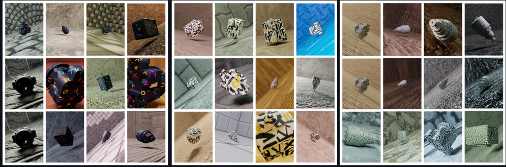

# Portfolio
---
## AutoML

### Earth Observation Neural Architecture Search Benchmark 

**Neural Architecture Search(NAS):** Neural Architecture Search (NAS) automates the process of architecture design of neural networks.  NAS approaches optimize the topology of the networks, incl. how to connect nodes and which operators to choose. User-defined optimization metrics can thereby include accuracy, model size or inference time to arrive at an optimal architecture for specific applications.

In this work, I have worked in a team of 5 and I was responsible for the design and creation of the  whole model training pipeline on High Performance Computer. In the end we were able to train more than thousand deep learning models with just a single submission.

 
## Computer Vision
### 3D Deformable Object Registration using Neural Networks

**3D Point Correspondence:** The 3D point correspondence problem is a fundamental problem in computer vision that involves matching points in two or more images of a 3D scene. The goal is to find the corresponding points between the images, which can be used to reconstruct the 3D structure of the scene. This problem arises in a wide range of applications, such as object tracking, stereo vision, and structure from motion.

In this work, we have used different methods to find point correspondences for 3D untextured and deformable objects with 2D images. Best solution was using SurfEmbeddings deep Learning model. You can find the related code in github repository and use it for your own.

Also, we have tried out if adding artificial textures to untextured objects increases the performance and it reduced the convergence time of the model significantly.

 
## Personal Usage 
### Etymology CLI in Rust 

It is a simple CLI tool that wrote while learning Rust language.
After enterıng a word, it returns the etymological root of that word togeter with the meaning.

© 2020 Khanh Tran. Powered by Jekyll and the Minimal Theme.

